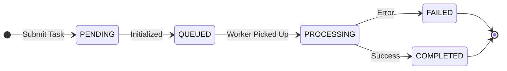

# API Reference Guide - Content search

This document defines the communication protocol between the Frontend and Backend for asynchronous file processing tasks.

---

## Global Response Specification

All HTTP Response bodies must follow this unified JSON structure:

| Field | Type | Required | Description |
| :--- | :--- | :--- | :--- |
| **code** | Integer | Yes | Application Logic Code. 20000 indicates success; others are logical exceptions. |
| **data** | Object/Array | Yes | Application data payload. Returns {} or [] if no data is available. |
| **message** | String | Yes | Human-readable message for frontend display (e.g., "Operation Successful"). |
| **timestamp** | Long | Yes | Server-side current Unix timestamp. |

### Response Example
```
HTTP/1.1 200 OK
Content-Type: application/json

{
  "code": 20000,
  "data": { "task_id": "0892f506-4087-4d7e-b890-21303145b4ee", "status": "PROCESSING" },
  "message": "Operation Successful",
  "timestamp": 167890123
}
```
---

## Status Codes and Task

### HTTP Status Codes (Network Layer)
| Code | Meaning | Frontend Handling Suggestion |
| :--- | :--- | :--- |
| 200 | OK | Proceed to parse Application Layer code. |
| 201 | Created | Resource successfully created and persisted in the database. |
| 202 | Accepted | Task accepted for the backend. |
| 401 | Unauthorized | Token expired; clear local storage and redirect to Login. |
| 403 | Forbidden | Insufficient permissions for this resource. |
| 422 | Unprocessable Entity | Parameter validation failed (e.g., wrong file format). |
| 500 | Server Error | System crash; display "Server is busy, please try again". |

### Application Layer Codes (code field)

| Application Code | Semantic Meaning | Description |
| :--- | :--- | :--- |
| 20000 | SUCCESS | Task submitted, query successful, or cleanup completed. |
| 40000 | BAD_REQUEST | General logic error (e.g., trying to delete a processing task). |
| 40001 | AUTH_FAILED | Invalid username or password. |
| 40901 | FILE_ALREADY_EXISTS | File already existed (Hash exist). |
| 50001 | FILE_TYPE_ERROR | Unsupported file format (Allowed: mp4, mov, jpg, png, pdf). |
| 50002 | TASK_NOT_FOUND | Task ID does not exist or has expired. |
| 50003 | PROCESS_FAILED | Internal processing error (e.g., file system or DB delete failed). |

---
### Task Lifecycle & Status Enum
The `status` field in the response follow this lifecycle:

| Status | Meaning | Frontend Action |
| :--- | :--- | :--- |
| PENDING | Task record created in DB. | Continue Polling. |
| QUEUED | Task is in the background queue, waiting for a worker. | Continue Polling. |
| PROCESSING | Task is currently being handled (e.g., transcoding). | Continue Polling (Show progress if available). |
| COMPLETED | Task finished successfully. | Stop Polling & Show Result. |
| FAILED | Task encountered an error. | Stop Polling & Show Error Message. |

### State Transition Diagram


## API Endpoints
### Task endpoints
#### Get Task List

* URL: /api/v1/task/list

* Method: GET

* Pattern: SYNC

Query Parameters:
| Parameter | Type    | Required | Default | Description                                         |
| :-------- | :------ | :------- | :------ | :-------------------------------------------------- |
| `status`  | `string`  | No       | None    | Filter by: `QUEUED`, `PROCESSING`, `COMPLETED`, `FAILED` |
| `limit`   | `integer` | No       | 100     | Max number of tasks to return (Min: 1, Max: 1000)   |

Request:
```
curl --location 'http://127.0.0.1:9011/api/v1/task/list?status=COMPLETED&limit=2'
```
Response (200 OK)
```json
{
    "code": 20000,
    "data": [
        {
            "status": "COMPLETED",
            "payload": {
                "source": "local",
                "file_key": "runs/f52c2905-fb78-4ddd-a89e-9fb673546740/raw/application/default/apple_loop100.h265",
                "bucket": "content-search",
                "filename": "apple_loop100.h265",
                "run_id": "f52c2905-fb78-4ddd-a89e-9fb673546740"
            },
            "result": {
                "message": "File successfully processed. db returns {}"
            },
            "progress": 0,
            "task_type": "file_search",
            "id": "56cc417c-9524-41a9-a500-9f0c44a05eac",
            "user_id": "admin",
            "created_at": "2026-03-24T12:50:34.281421"
        },
        {
            "status": "COMPLETED",
            "payload": {
                "source": "local",
                "file_key": "runs/2949cc0e-a1aa-4001-aa0f-8f42a36c3e7c/raw/application/default/apple_loop100.h265",
                "bucket": "content-search",
                "filename": "apple_loop100.h265",
                "run_id": "2949cc0e-a1aa-4001-aa0f-8f42a36c3e7c"
            },
            "result": {
                "message": "File successfully processed. db returns {}"
            },
            "progress": 0,
            "task_type": "file_search",
            "id": "8032db45-129b-4474-8d58-122f33661f19",
            "user_id": "admin",
            "created_at": "2026-03-24T12:48:13.301178"
        }
    ],
    "message": "Success",
    "timestamp": 1774330753
}
```
#### Task Status Polling
Used to track the progress and retrieve the final result of a submitted task.

* URL: /api/v1/task/query/{task_id}

* Method: GET

* Pattern: SYNC

Request:
```
curl --location 'http://127.0.0.1:9011/api/v1/task/query/6b9a6a55-d327-42fe-b05e-e0f3098fe797'
```

Response (200 OK):
```json
{
    "code": 20000,
    "data": {
        "task_id": "6b9a6a55-d327-42fe-b05e-e0f3098fe797",
        "status": "COMPLETED",
        "progress": 100,
        "result": {
            "message": "Upload only, no ingest requested",
            "file_info": {
                "source": "local",
                "file_key": "runs/9e96f16a-9689-4c25-a515-04a1040b193f/raw/text/default/phy_class.txt",
                "bucket": "content-search",
                "filename": "phy_class.txt",
                "run_id": "9e96f16a-9689-4c25-a515-04a1040b193f"
            }
        }
    },
    "message": "Query successful",
    "timestamp": 1774931711
}
```
### File Process
#### File Support Matrix

The system supports the following file formats for all ingestion and upload-ingest operations.

| Category | Supported Extensions | Processing Logic |
| :--- | :--- | :--- |
| **Video** | `.mp4` | Frame extraction, AI-driven summarization, and semantic indexing. |
| **Document** | `.txt`, `.pdf`, `.docx`, `.doc`, `.pptx`, `.ppt`, `.xlsx`, `.xls` | Full-text extraction, semantic chunking, and vector embedding. |
| **Web/Markup** | `.html`, `.htm`, `.xml`, `.md` | Structured text parsing and content indexing. |
| **Image** | `.jpg`, `.png`, `.jpeg` | Visual feature embedding and similarity search indexing. |

> **Technical Note**: 
> - **Video**: Default chunking is set to 30 seconds unless the `chunk_duration` parameter is provided.
> - **Text**: Automatic semantic segmentation is applied to ensure high-quality retrieval results.
> - **Max File Size**: Please refer to the `CS_MAX_CONTENT_LENGTH` environment variable (Default: 100MB).

#### File Upload
Used to upload a video file and initiate an asynchronous background task.

* URL: /api/v1/object/upload
* Method: POST
* Content-Type: multipart/form-data
* Payload: file (Binary)
* Pattern: ASYNC

Request:
```
curl --location 'http://127.0.0.1:9011/api/v1/object/upload' \
--form 'file=@"/C:/videos/videos/car-detection-2min.mp4"'
```
Response (200 OK):
```json
{
    "code": 20000,
    "data": {
        "task_id": "c68211de-2187-4f52-b47d-f3a51a52b9ca",
        "status": "PROCESSING"
    },
    "message": "File received, processing started.",
    "timestamp": 1773909147
}
```

#### File ingestion
* URL: /api/v1/object/ingest
* Method: POST
* Pattern: ASYNC
* Parameters:

| Field | Type | Required | Description |
| :--- | :--- | :--- | :--- |
| `file_key` | `string` | Yes | The full path of the file in storage (excluding bucket name). |
| `bucket_name` | `string` | No | The storage bucket name. Defaults to content-search. |
| `prompt` | `string` | No | Instructions for the AI (VLM). Defaults to "Please summarize this video." |
| `chunk_duration` | `integer` | No | Duration of each video segment in seconds. Defaults to 30. |
| `meta` | `object` | No | Custom metadata (e.g., {"tags": ["lecture"]}). Used for filtering during search. |

Request:
```
curl --location 'http://127.0.0.1:9011/api/v1/object/ingest' \
--header 'Content-Type: application/json' \
--data '{
    "bucket_name": "content-search", 
    "file_key": "runs/c9a34e33-284a-48af-8d41-2b0d7d2989a7/raw/video/default/classroom_8.mp4"
}'
```
Response:
```json
{
    "code": 20000,
    "data": {
        "task_id": "44e339fb-3306-41b8-b1e1-4ecae7ce0ada",
        "status": "PROCESSING",
        "file_key": "runs/c9a34e33-284a-48af-8d41-2b0d7d2989a7/raw/video/default/classroom_8.mp4"
    },
    "message": "Ingestion process started for existing file",
    "timestamp": 1774878031
}
```

#### Text file ingestion

Embeds the raw text string passed in the request body as a single node, **no chunking** and stores it in the vector database. Use this when you already have clean, pre-processed text and want to **skip file preprocess and chunking** entirely.

It also supports fetching content from existing text-based objects in storage.

* URL: /api/v1/object/ingest-text
* Method: POST
* Pattern: ASYNC
* Parameters:

| Field | Type | Required | Description |
| :--- | :--- | :--- | :--- |
| `text` | `string` | **Yes** | **Raw text content** to be embedded, and stored in the vector database. |
| `bucket_name` | `string` | No | Storage bucket name (used to logically group the data or build the identifier). |
| `file_path` | `string` | No | Logical path or filename (used as a unique identifier for the text source). |
| `meta` | `object` | No | Extra metadata to store alongside the text (e.g., `course`, `author`, `tags`). |

Request:
```
# example for raw text content
curl --location 'http://127.0.0.1:9011/api/v1/object/ingest-text' \
--header 'Content-Type: application/json' \
--data '{
    "text": "Newton'\''s Second Law of Motion states that the force acting on an object is equal to the mass of that object multiplied by its acceleration (F = ma). This relationship describes how the velocity of an object changes when it is subjected to an external force.",
    "meta": {
        "source": "topic-search"
    }
}'
```
Response:
```json
{
    "code": 20000,
    "data": {
        "task_id": "df3caeb3-3287-4e41-a1f0-098c90d08e03",
        "status": "PROCESSING"
    },
    "message": "Text ingestion task created successfully",
    "timestamp": 1775006765
}
```

#### File upload and ingestion
A unified workflow that first saves the file to local storage and then immediately initiates the ingestion pipeline. Features full content indexing and AI-driven Video Summarization for supported video formats.

* URL: /api/v1/object/upload-ingest
* Method: POST
* Content-Type: multipart/form-data
* Pattern: ASYNC
* Parameters:

| Field | Type | Required | Description |
| :--- | :--- | :--- | :--- |
| `file` | `Binary` | Yes | The video file to be uploaded. |
| `prompt` | `string` | No | Summarization instructions (passed as a Form field). |
| `chunk_duration` | `integer` | No | Segment duration in seconds (passed as a Form field). |
| `meta` | `string` | No | JSON string of metadata (e.g., '{"course": "CS101"}'). |

* Example:
Request:
```
curl --location 'http://127.0.0.1:9011/api/v1/object/upload-ingest' \
--form 'file=@"/C:/videos/videos/classroom_8.mp4"' \
--form 'meta="{\"tags\": [\"class\"], \"course\": \"CS101\", \"semester\": \"Spring 2026\"}"'
```
Response (200 OK):
```json
// example 1: Normal upload and ingest
{
    "code": 20000,
    "data": {
        "task_id": "559814ae-cef6-475c-9a79-3819549228d9",
        "status": "PROCESSING",
        "file_key": "runs/a955dbfc-59eb-4e40-953f-0cfe55e54464/raw/video/default/classroom_8.mp4"
    },
    "message": "Upload and Ingest started",
    "timestamp": 1774878113
}
// example 2: File already exists, return the existed taskid
{
    "code": 40901,
    "data": {
        "file_hash": "080c00cf05bc7b31e2b1c4bcfc9b16a61b29608fdbfc5451d1cbd8eadbdd34cb",
        "file_name": "classroom_8.mp4",
        "created_at": "2026-04-14 14:33:53.107540",
        "task_id": "559814ae-cef6-475c-9a79-3819549228d9"
    },
    "message": "Upload failed: File already exists.",
    "timestamp": 1776148605
}
```

#### Retrieve and Search
Executes a similarity search across vector collections using either natural language queries or base64-encoded images. Returns ranked results with associated metadata and object references.

* URL: /api/v1/object/search
* Method: POST
* Content-Type: multipart/form-data
* Pattern: SYNC
* Parameters:

| Field | Type | Required | Description |
| :--- | :--- | :--- | :--- |
| `query` | `string` | Either | Natural language search query (e.g., "student at desk"). |
| `image_base64` | `string` | Either | Base64 encoded image string for visual similarity search. |
| `max_num_results` | `integer` | No | Maximum number of results to return. Defaults to 10. For text queries, up to `2 × max_num_results` may be returned (`top-k` from visual collection + `top-k` from document collection, merged and sorted by distance). For image queries, at most `max_num_results` are returned.|
| `filter` | `object` | No | Metadata filters (e.g., {"type": ["document"], "tags": ["class"]}), detail sees below |

* Filter Usage Detail

Different filter keys are always combined with `AND`. When a filter value is a `list`, the matching logic depends on the field type:

| Field type | Example fields | List behavior | Operator used |
| ---------- | -------------- | ------------- | ------------- |
| `Array metadata` | `tags` | Matches if the stored array contains **at least one** of the filter values | `$contains` |
| `Scalar metadata` | `type`, `course`, `semester` | Matches if the stored value **equals any** of the filter values | `$eq` (OR) |

| Note: Video-type results may appear even when "video" is not explicitly selected in the type filter, because relevant document summaries can be converted into video results during post-processing. These constructed results have "original_type": "constructed_from_summary" in their metadata to distinguish them from native video frame results.

* Example:
Request:
```
# Example 1: Filter by tags — returns results whose tags array contains "test_tag1" or "test_tag2"
curl --location 'http://127.0.0.1:9011/api/v1/object/search' \
--header 'Content-Type: application/json' \
--data '{
    "query": "classroom",
    "max_num_results": 2,
    "filter": {
        "tags": ["test_tag1", "test_tag2"]
    }
}'
# Example 2: Filter by type — available values: `video`, `image`, `document`. If not specified, all types are returned. Example returns only `video` or `document` results:
curl --location 'http://127.0.0.1:9011/api/v1/object/search' \
--header 'Content-Type: application/json' \
--data '{
    "query": "student in classroom",
    "max_num_results": 1,
    "filter": {
        "type": ["video", "document"]
    }
}'
```
Response (200 OK):
```json
{
    "code": 20000,
    "data": {
        "task_id": "4d3159df-93d1-44a9-8592-bc48eb561b05",
        "status": "COMPLETED",
        "results": [
            {
                "id": "197972195449837430",
                "distance": 0.8402439,
                "meta": {
                    "type": "video",
                    "file_path": "local://content-search/runs/2a6e14b6-da45-4e20-93a1-2291ab01d6f6/raw/video/default/store-aisle-detection.mp4",
                    "file_name": "store-aisle-detection.mp4",
                    "video_pin_second": 11.01,
                    "video_start_second": 7.76,
                    "video_end_second": 14.26,
                    "summary_text": "The video ... e store's layout and organization allow customers to easily navigate through the aisles and find their desired items."
                },
                "score": 53.65
            },
            {
                "id": "435369449869751787",
                "distance": 0.7416173,
                "meta": {
                    "type": "image",
                    "file_path": "local://content-search/runs/7a4480af-3f9c-40b6-ac9e-0a698717bc45/raw/image/default/classroom.jpg",
                    "file_name": "classroom.jpg",
                    "tags": [
                        "img_tag1",
                        "img_tag2"
                    ]
                },
                "score": 83.56
            },
            {
                "id": "3898473585704952476",
                "distance": 0.19918823,
                "meta": {
                    "doc_filename": "ComputerScienceOne.pdf",
                    "doc_is_continuation": true,
                    "doc_last_modified": "2026-04-14T20:56:13",
                    "doc_sequence_number": 448,
                    "chunk_text": "tegral. Instead, Computer Science is the study of computers and computation. It involves studying and understanding computational processes and the development of algorithms and techniques and how they apply to problems.",
                    "chunk_index": 448,
                    "type": "document",
                    "doc_filetype": "application/pdf",
                    "doc_page_number": 36,
                    "doc_languages": "[\"eng\"]",
                    "doc_file_directory": "C:\\Users\\user\\AppData\\Local\\Temp\\tmpwma1e266",
                    "file_path": "local://content-search/runs/a6d3ef1f-510b-4ec9-8a16-4db2332758b0/raw/application/default/ComputerScienceOne.pdf",
                    "file_name": "ComputerScienceOne.pdf",
                    "tags": [
                        "pdf_tag1",
                        "pdf_tag2"
                    ]
                },
                "score": 99.81,
                "reranker_score": 6.28125
            }
        ]
    },
    "message": "Search completed",
    "timestamp": 1776171542
}
```
#### Resource Download (Video/Image/Document)
Download or preview existing resources from storage.

* URL: /api/v1/object/download
* Method: GET
* Pattern: SYNC
* Parameters:

| Field | Type | Required | Description |
| :--- | :--- | :--- | :--- |
| `file_key` | `string` | Yes | The full path of the file in storage (e.g., "runs/xxx/raw/video/default/file.mp4"). |
| `inline` | `boolean` | No | If `true`, sets `Content-Disposition: inline` for browser preview (PDF, video, image). If `false` or omitted, forces download with `Content-Disposition: attachment`. Defaults to `false`. |

Request:
```bash
# Example 1: Download file (default behavior)
curl --location 'http://127.0.0.1:9011/api/v1/object/download?file_key=runs%2Fc9a34e33-284a-48af-8d41-2b0d7d2989a7%2Fraw%2Fvideo%2Fdefault%2Fclassroom_8.mp4'

# Example 2: Preview file in browser (PDF, video, image)
curl --location 'http://127.0.0.1:9011/api/v1/object/download?file_key=runs%2Fc9a34e33-284a-48af-8d41-2b0d7d2989a7%2Fraw%2Fapplication%2Fdefault%2Fdocument.pdf&inline=true'
```

**Usage Notes**:
- Use `inline=true` for embedding resources in `<iframe>`, `<video>`, or `` tags for in-browser preview.
- Use `inline=false` (or omit) when you need to trigger a download prompt in the browser.

#### Cleanup file storage and record
Removes all physical and logical footprints associated with a specific task, including local storage files, indexed vectors in ChromaDB, and metadata records in the database.

* URL: /api/v1/object/cleanup-task/{task_id}

* Method: DELETE

* Pattern: SYNC

* Parameters:

| Field | Type | Required | Description |
| :--- | :--- | :--- | :--- |
| `task_id` | `string` | Yes | The unique identifier (UUID) of the task to be cleaned up. |

Request:
```powershell
curl --location --request DELETE 'http://127.0.0.1:9011/api/v1/object/cleanup-task/b14b0c14-e768-4536-9d13-ea556f9adc1b'
```
Response:
```json
// example 1: 200 OK - Success
{
    "code": 20000,
    "data": {
        "task_id": "b14b0c14-e768-4536-9d13-ea556f9adc1b",
        "status": "COMPLETED"
    },
    "message": "Cleanup completed",
    "timestamp": 1775723734
}
// example 2: 200 OK - Task Processing
{
    "code": 40000,
    "data": {},
    "message": "Task is still processing and cannot be deleted",
    "timestamp": 1775723800
}
// example 3: 200 OK - Task Not Found
{
    "code": 50002,
    "data": {},
    "message": "Task ID does not exist or has expired",
    "timestamp": 1775723850
}
```

#### List All Indexed Files
Returns a comprehensive inventory of all files stored in the system, including their metadata, storage status, and indexing information. This endpoint aggregates data from SQLite (file metadata), LocalStorage (physical file existence), and ChromaDB (vector indices).

* URL: /api/v1/object/files/list
* Method: GET
* Pattern: SYNC
* Parameters:

| Parameter | Type | Required | Default | Description |
| :-------- | :--- | :------- | :------ | :---------- |
| `page` | `integer` | No | 1 | Page number for pagination (Min: 1) |
| `page_size` | `integer` | No | 50 | Number of items per page (Min: 1, Max: 200) |
| `file_type` | `string` | No | None | Filter by file type: `video`, `image`, or `document` |

Request:
```bash
# Example 1: Get first page with default settings
curl --location 'http://127.0.0.1:9011/api/v1/object/files/list'

# Example 2: Get specific page with custom page size
curl --location 'http://127.0.0.1:9011/api/v1/object/files/list?page=2&page_size=10'

# Example 3: Filter by file type
curl --location 'http://127.0.0.1:9011/api/v1/object/files/list?file_type=video'
```

Response (200 OK):
```json
{
    "code": 20000,
    "data": {
        "total": 6,
        "page": 1,
        "page_size": 50,
        "total_pages": 1,
        "files": [
            {
                "file_hash": "ec2c2b5d7088dd212acd4fca2ecfd0abe4fca2379f3f02035d028d7423963666",
                "file_name": "SW-Physics-Sample.pdf",
                "file_path": "runs/95351707-a723-4af5-92df-579f18707871/raw/application/default/SW-Physics-Sample.pdf",
                "bucket_name": "content-search",
                "content_type": "application/pdf",
                "size_bytes": 6847573,
                "meta": {},
                "created_at": "2026-04-24T09:32:18.779690",
                "storage": {
                    "exists": true
                },
                "index": {
                    "indexed": false,
                    "vector_count": 0,
                    "collections": [],
                    "has_summary": false
                },
                "status": "not_indexed"
            },
            ... ...
            {
                "file_hash": "6f3fd0ad5a592a8bd2fd877ab613bb3a7837ab04ad62baac9067e6f583629a75",
                "file_name": "ComputerScienceOne.pdf",
                "file_path": "runs/266c1ba1-0684-41cd-891d-621b240f1877/raw/application/default/ComputerScienceOne.pdf",
                "bucket_name": "content-search",
                "content_type": "application/pdf",
                "size_bytes": 2300943,
                "meta": {
                    "tags": [
                        "computer",
                        "pdf",
                        "book"
                    ],
                    "course": "CS101",
                    "semester": "Spring 2026"
                },
                "created_at": "2026-04-15T13:19:49.777220",
                "storage": {
                    "exists": false
                },
                "index": {
                    "indexed": false,
                    "vector_count": 0,
                    "collections": [],
                    "has_summary": false
                },
                "status": "inconsistent"
            }
        ],
        "statistics": {
            "by_status": {
                "not_indexed": 4,
                "inconsistent": 2
            },
            "by_type": {
                "unknown": 6
            }
        }
    },
    "message": "Files retrieved successfully",
    "timestamp": 1777009127
}
```

**Response Fields**:

| Field | Type | Description |
| :---- | :--- | :---------- |
| `total` | `integer` | Total number of files matching the filter |
| `page` | `integer` | Current page number |
| `page_size` | `integer` | Number of items per page |
| `total_pages` | `integer` | Total number of pages available |
| `files` | `array` | Array of file objects (see File Object below) |
| `statistics` | `object` | Aggregated statistics by status and type |

**File Object Fields**:

| Field | Type | Description |
| :---- | :--- | :---------- |
| `file_hash` | `string` | SHA-256 hash of the file (unique identifier) |
| `file_name` | `string` | Original filename |
| `file_path` | `string` | Full path in storage system |
| `bucket_name` | `string` | Storage bucket name |
| `content_type` | `string` | MIME type of the file |
| `size_bytes` | `integer` | File size in bytes |
| `meta` | `object` | Custom metadata (tags, course info, etc.) |
| `created_at` | `string` | ISO 8601 timestamp of file creation |
| `storage.exists` | `boolean` | Whether the physical file exists in LocalStorage |
| `index.indexed` | `boolean` | Whether the file has been indexed in ChromaDB |
| `index.vector_count` | `integer` | Total number of vector embeddings for this file |
| `index.collections` | `array` | List of ChromaDB collections containing this file's vectors |
| `index.has_summary` | `boolean` | Whether the video has AI-generated text summaries |
| `status` | `string` | Overall status: `synced`, `not_indexed`, `missing_file`, or `inconsistent` |

**Status Values**:

| Status | Description | Action Required |
| :----- | :---------- | :-------------- |
| `synced` | File exists in storage and is fully indexed | None - healthy state |
| `not_indexed` | File exists but hasn't been indexed yet | Wait for indexing or trigger manual ingest |
| `missing_file` | Index exists but physical file is missing | File was deleted externally - consider cleanup |
| `inconsistent` | Neither storage nor index exists | Database corruption - consider record cleanup |

**Use Cases**:
- **Frontend File Browser**: Display all uploaded files with their processing status
- **Admin Dashboard**: Monitor system health and identify orphaned records
- **Bulk Operations**: Get file lists for batch cleanup or re-indexing
- **Debugging**: Investigate storage/index inconsistencies

#### Delete File by Hash
Deletes a file and all its associated data using the file_hash obtained from `/api/v1/object/files/list`.

* URL: /api/v1/object/files/{file_hash}
* Method: DELETE
* Pattern: SYNC
* Parameters:

| Parameter | Type | Required | Default | Description |
| :-------- | :--- | :------- | :------ | :---------- |
| `file_hash` | `string` | Yes | - | SHA-256 hash of the file (from `/files/list` response) |
| `force` | `boolean` | No | `false` | If `true`, continue deletion even if some steps fail |

Request:
```bash
# Example 1: Standard deletion
curl -X DELETE 'http://127.0.0.1:9011/api/v1/object/files/080c00cf05bc7b31e2b1c4bcfc9b16a61b29608fdbfc5451d1cbd8eadbdd34cb'

# Example 2: Force deletion (ignore errors)
curl -X DELETE 'http://127.0.0.1:9011/api/v1/object/files/080c00cf05bc7b31e2b1c4bcfc9b16a61b29608fdbfc5451d1cbd8eadbdd34cb?force=true'
```

Response (200 OK):
```json
{
    "code": 20000,
    "data": {
        "file_hash": "080c00cf05bc7b31e2b1c4bcfc9b16a61b29608fdbfc5451d1cbd8eadbdd34cb",
        "file_name": "classroom_8.mp4",
        "file_path": "runs/a955dbfc-59eb-4e40-953f-0cfe55e54464/raw/video/default/classroom_8.mp4",
        "bucket_name": "content-search",
        "storage_deleted": true,
        "index_deleted": true,
        "metadata_deleted": true,
        "tasks_deleted": 2,
        "errors": []
    },
    "message": "File and all associated data deleted successfully",
    "timestamp": 1776200456
}
```

**Deletion Process (4 Phases):**

1. **Phase 1: LocalStorage** - Deletes the physical file from disk
2. **Phase 2: ChromaDB** - Removes all vector indices for this file
3. **Phase 3: SQLite file_assets** - Deletes metadata record
4. **Phase 4: SQLite edu_ai_tasks** - Removes associated task records

**Response Fields:**

| Field | Type | Description |
| :---- | :--- | :---------- |
| `storage_deleted` | `boolean` | Whether the physical file was deleted from LocalStorage |
| `index_deleted` | `boolean` | Whether vector indices were deleted from ChromaDB |
| `metadata_deleted` | `boolean` | Whether the file_assets record was deleted |
| `tasks_deleted` | `integer` | Number of associated tasks deleted |
| `errors` | `array` | List of errors encountered (empty if all successful) |

**Error Handling:**

- **force=false** (default): Stops at first error and returns HTTP 500
- **force=true**: Continues deletion even if some steps fail, reports errors in response

**Use Cases:**

- **Direct file management**: Delete files directly from the files list UI
- **Cleanup orphaned files**: Remove files that are no longer needed
- **Manual intervention**: Delete specific files after reviewing `/files/list`

**Comparison with /cleanup-task/{task_id}:**

| Feature | `/files/{file_hash}` | `/cleanup-task/{task_id}` |
| :------ | :------------------- | :------------------------ |
| **Input** | file_hash (from `/files/list`) | task_id (from task APIs) |
| **Use Case** | Delete files directly | Delete by task workflow |
| **Orphan Files** | √ Can delete | × Requires task record |
| **Task Check** | × No status check | √ Checks if processing |

**Workflow Example:**

```bash
# Step 1: List all files
curl 'http://127.0.0.1:9011/api/v1/object/files/list'

# Step 2: Identify file to delete (copy file_hash)
# Example: "file_hash": "080c00cf05bc..."

# Step 3: Delete the file
curl -X DELETE 'http://127.0.0.1:9011/api/v1/object/files/080c00cf05bc...'

# Step 4: Verify deletion
curl 'http://127.0.0.1:9011/api/v1/object/files/list'
# File should no longer appear in the list
```

**Security Notes:**
- This operation is **irreversible** - deleted files cannot be recovered
- Deletes data from all three storage layers simultaneously
- Consider backing up important files before deletion
- Use `force=true` cautiously as it may leave partial data

#### List Tags
Returns all unique tags that have been assigned to uploaded files. Useful for populating filter dropdowns in the UI.

* URL: /api/v1/object/tags
* Method: GET
* Pattern: SYNC

Request:
```bash
curl --location 'http://127.0.0.1:9011/api/v1/object/tags'
```
Response (200 OK):
```json
{
    "code": 20000,
    "data": [
        "English",
        "Math",
        "Physics"
    ],
    "message": "Tags retrieved",
    "timestamp": 1776200000
}
```

### System Endpoints

#### Get System Configuration
Returns the current Content Search model configuration and feature flags.

* URL: /api/v1/system/config
* Method: GET
* Pattern: SYNC

Request:
```bash
curl --location 'http://127.0.0.1:9011/api/v1/system/config'
```
Response (200 OK):
```json
{
    "vlm_model": "Qwen/Qwen2.5-VL-3B-Instruct",
    "visual_embedding_model": "CLIP/clip-vit-b-16",
    "doc_embedding_model": "BAAI/bge-small-en-v1.5",
    "reranker_model": "BAAI/bge-reranker-large",
    "vector_db": "ChromaDB (127.0.0.1:9090)",
    "video_summarization_enabled": true
}
```

| Field | Type | Description |
| :--- | :--- | :--- |
| `vlm_model` | `string` | Vision-Language Model used for video summarization. |
| `visual_embedding_model` | `string` | Model used for image/video frame embedding. |
| `doc_embedding_model` | `string` | Model used for document text embedding. |
| `reranker_model` | `string` | Model used for search result reranking. |
| `vector_db` | `string` | Vector database connection info. |
| `video_summarization_enabled` | `boolean` | Whether the video summarization feature is enabled. When `false`, the UI should hide summarization-related controls. |

#### Reconcile Storage Consistency
Performs bidirectional consistency checks across SQLite, LocalStorage, and ChromaDB. Detects and optionally cleans up orphaned records, missing files, and inconsistent data.

* URL: /api/v1/system/reconcile
* Method: POST
* Pattern: SYNC
* Parameters:

| Parameter | Type | Required | Default | Description |
| :-------- | :--- | :------- | :------ | :---------- |
| `dry_run` | `boolean` | No | `true` | If `true`, only checks without deleting. Set to `false` to execute cleanup. |
| `cleanup_sqlite_orphans` | `boolean` | No | `true` | Clean SQLite records when both storage and index are missing. |
| `cleanup_storage_orphans` | `boolean` | No | `true` | Delete LocalStorage files without SQLite records. |
| `cleanup_index_orphans` | `boolean` | No | `true` | Delete ChromaDB indices without SQLite records. |
| `auto_reindex` | `boolean` | No | `false` | Automatically trigger reindexing for files without indices (experimental). |
| `report_detail` | `string` | No | `"summary"` | Report level: `"summary"` or `"detailed"` (includes file lists). |

Request:
```bash
# Safe check (dry run - default)
curl -X POST 'http://127.0.0.1:9011/api/v1/system/reconcile'

# Execute cleanup (destructive)
curl -X POST 'http://127.0.0.1:9011/api/v1/system/reconcile?dry_run=false'

# Get detailed report
curl -X POST 'http://127.0.0.1:9011/api/v1/system/reconcile?report_detail=detailed'
```

Response (200 OK):
```json
{
    "status": "ok",
    "mode": "dry_run",
    "summary": {
        "total_files_in_sqlite": 150,
        "total_files_in_storage": 155,
        "total_indexed_paths": 148,
        "synced_files": 145,
        "inconsistencies_found": {
            "sqlite_orphans": 3,
            "storage_orphans": 5,
            "index_orphans": 2,
            "missing_storage": 1,
            "missing_index": 4,
            "missing_both": 2
        },
        "actions_taken": {
            "sqlite_records_deleted": 0,
            "storage_files_deleted": 0,
            "index_entries_deleted": 0,
            "reindex_triggered": 0
        }
    },
    "recommendations": [
        "Found 3 SQLite orphan(s). Run with dry_run=false and cleanup_sqlite_orphans=true to clean them.",
        "Found 5 orphaned file(s) in LocalStorage. Run with dry_run=false and cleanup_storage_orphans=true to delete them.",
        "Found 2 orphaned index/indices in ChromaDB. Run with dry_run=false and cleanup_index_orphans=true to delete them.",
        "Found 4 file(s) without indices. Consider running with auto_reindex=true to reindex them."
    ]
}
```

**Three-Phase Check Process:**

1. **Phase 1: SQLite → Storage/Index** - Checks each database record against physical storage
2. **Phase 2: LocalStorage → SQLite** - Finds orphaned files without database records  
3. **Phase 3: ChromaDB → SQLite** - Finds orphaned indices without database records

**Inconsistency States:**

| SQLite | LocalStorage | ChromaDB | Status | Action |
|--------|--------------|----------|--------|--------|
| √ | √ | √ | Synced | None (healthy) |
| √ | √ | × | Missing Index | Reindex (if enabled) |
| √ | × | √ | Missing Storage | Delete SQLite + Index |
| √ | × | × | Missing Both | Delete SQLite record |
| × | √ | - | Storage Orphan | Delete file |
| × | - | √ | Index Orphan | Delete index |
